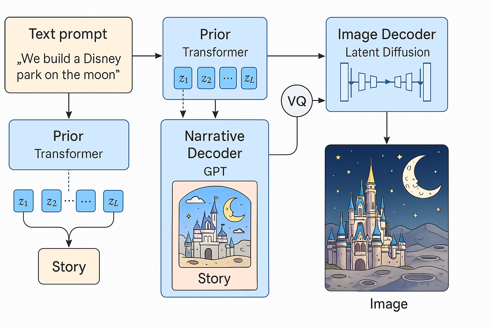

# StoryDiffusion: Joint Visual–Textual Story Generator

*Girish Krishnan*



> *Generate a short illustrated story from a single-line prompt in one shot.*
> This repository contains a **research‑grade prototype** that combines a GPT‑style language model with a Stable‑Diffusion image pipeline via a discrete **storyboard bottleneck**.

---

## 1  Design Overview

The system is factorised into four learned components (see figure above):

| # | Module                   | Symbol                     | Objective                   |
| - | ------------------------ | -------------------------- | --------------------------- |
| 1 | **Vector‑Quantised VAE** | $q_\phi(\mathbf{z}\mid s)$ | discretise story tokens     |
| 2 | **Prior Transformer**    | $p_\theta(\mathbf{z})$     | autoregressive latent model |
| 3 | **Causal LM**            | $p_\psi(s\mid \mathbf{z})$ | text generation             |
| 4 | **Latent Diffusion**     | $p_\omega(x\mid s)$        | image generation            |

### 1.1  Training ELBO

For each data triple $(s,x)$ (paragraph & image) we minimise the negative Evidence Lower Bound

```math
\mathcal{L} = \underbrace{\mathbb{E}_{q_\phi}[ -\log p_\psi(s\mid \mathbf{z}) ]}_{\text{NLL}_\text{text}}
\; + \; \beta_\mathrm{KL}\,\underbrace{\mathbb{E}_{q_\phi}[ -\log p_\theta(\mathbf{z}) ]}_{\text{latent NLL}}
\; + \; \underbrace{\mathcal{L}_\mathrm{VQ}}_{\text{commit.}}
\; + \; \underbrace{\lambda\, \mathbb{E}[\|\epsilon\_\omega(\mathbf{z}_t)-\epsilon\|^2]}_{\text{diffusion NLL}}
```

where $\mathcal{L}_\mathrm{VQ}$ is the EMA Vector‑Quantiser loss and the last term is the Monte‑Carlo $\epsilon$-prediction MSE of the frozen **Stable‑Diffusion** UNet.

### 1.2  Vector‑Quantised Storyboard

Story tokens $s\in\mathbb{N}^{L}$ are embedded and encoded by a 6‑layer Transformer encoder
$z_e = f_\text{enc}(\text{Embed}(s))\in\mathbb{R}^{L\times D}$whose output is quantised
$\mathbf{z}=\text{VQ}(z_e) \in \{1,\dots,K\}^{L}$with EMA updates as in $\small\text{van den Oord et al., 2017}.$

Afterwards the length is pooled to a fixed $\ell=8$ by majority‑vote over equal chunks:
$\tilde{\mathbf z}[j]=\text{mode}\big(\mathbf{z}[\,j\cdot k:(j+1)k)\big).$

### 1.3  Latent Prior

The prior Transformer maximises the log‑likelihood of the code sequence
$\log p_\theta(\mathbf z)=\sum_{t=1}^{\ell-1}\log p_\theta( z_{t+1}\mid z_{\le t}).$

### 1.4  Conditional Generators

* **Text LM** (GPT‑2‑XL) is frozen except for the learnable tokens $\mathbf z$ prepended to the prompt.
* **Image UNet + VAE** are frozen; their NLL is estimated with a single random diffusion timestep following $\small\text{Ho et al., 2020}.$

---

## 2  Data Preparation

```bash
# 1. create & activate virtualenv (see requirements below)
python download_data.py        # builds data/train & data/val
```

The script streams the **M3IT** image‑paragraph dataset from the 🤗 Hub, saves JPEGs to `data/*/images/` and writes aligned `stories.jsonl` files.

---

## 3  Training

```bash
python story_generative_model.py train \
  --mixed_precision fp16            # default
```

Checkpoints are written every *5 k* steps to `checkpoints/story_gen/`.
TensorBoard logs (loss, learning‑rate) are stored in the same folder.

---

## 4  Inference

```bash
python story_generative_model.py generate \
  --prompt "Build a Disney park on the moon" \
  --ckpt checkpoints/story_gen/ckpt_10000.pt
```

The script prints the generated story and saves `generated.png`.

**Example Input:** *We build a Disney Park on the Moon*.

**Example Output:** We build a Disney park on the moon. It's a space amusement ride in which people ride around a giant white structure on a cable‑tray (or you can just imagine it as a floating track). You might get an astronaut who gets stuck on a small planet; then one day you'll get a spaceman who finds himself trapped in a giant ball—the moon! The ball's walls will rotate, the ball's color will change, and you'll find yourself floating up on the ball. Sounds like fun! And no more worries about running out of oxygen, or getting stranded in a wormhole, or what to wear in space! We use a lot of real equipment from outer space!

We fly into space and explore planets, asteroids, and moons. We might visit an icy world at its closest point to Earth, as close as 100 million miles away! Then we'll orbit it once or twice and visit it for five minutes. After that, we'll drop off the spacecraft so it can "hover" around Jupiter (and Pluto). You'll be able to watch us fly by Jupiter, and then observe Saturn, Uranus, Neptune, Pluto (if they have them) from the planet's rings as the spacecraft orbits around them. When we're gone, a little capsule will land and you can return home.

In this scenario, we would travel through the atmosphere at 40,000 mph, traveling at 1/10th the speed of sound. As we went further, the heat from friction would melt the ice we're travelling through, making it rise. This may sound incredible, but remember that at higher velocities, the air will move faster—meaning the temperature will also rise. At 60,000 mph (90 km/s), that means the air will feel 10 times the intense heat from the planet—at 60,000 mph (90 km/s), the air would feel almost 4 million degrees. This means you'd be vaporized.


Or perhaps you'd like to fly to the moon. The rocket would be like the one pictured, except this time, the booster had to go into the lunar gravity well (think about the fact that if the Moon is spinning so fast that you're stuck on its surface, the whole spacecraft would get torn apart by the centrifugal forces). This rocket could make it there—a far-off goal even by today's technology.

**Generated Image:** 

---

## 5  Installation

```bash
conda create -n storydiffusion python=3.11 -y
conda activate storydiffusion
pip install -r requirements.txt
```

The project has been tested on **Python 3.11**, **PyTorch 2.2** with CUDA 11.8.

<details><summary><code>requirements.txt</code></summary>

```text
torch>=2.2
transformers>=4.39
accelerate>=0.26
diffusers>=0.26
datasets>=2.18
pillow
pandas
tqdm
```

</details>

---

## 6  Repository Structure

```
├── download_data.py          # build dataset
├── story_generative_model.py # training + inference
├── assets/                   # diagrams & samples
├── data/                     # created after running script
└── requirements.txt
```

---

## 7  License

Released under the MIT License. See [LICENSE](LICENSE) for details.
